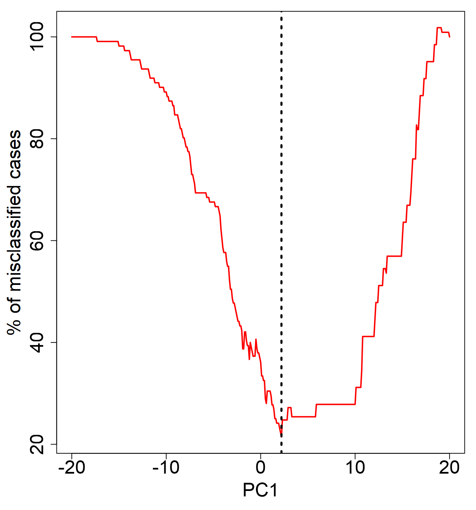

#
<style>
p.caption {
  font-size: 0.8em;
}

sup {
    line-height: 0;
    font-size: 0.83em;
    vertical-align: super;
}

.math {
  font-size: small;
}
</style>

```{r, include = FALSE}
knitr::opts_chunk$set(
  collapse = TRUE,
  comment = "#>"
)
```


```{r, echo=FALSE}
library(knitr)
Sys.setenv(LANGUAGE = "en")
```

# Contents

* [1. Introduction](#Section.1)
- [2. Installation](#Section.2)
- [3. Deriving PCAPAM50 Calls Using Provided Test Data](#Section.3)
  - [3.1 Pipeline Overview](#Section.3.1)
    - [3.1.1 makeCalls.PC1ihc - Intermediate Intrinsic Subtype Calls](#Section.3.1.1)
    - [3.1.2 makeCalls.v1PAM - PCAPAM50 Intrinsic Subtype Calls](#Section.3.1.2)
  - [3.2 - The Conventional PAM50 Approach](#Section.3.2)
    - [3.2.1 makeCalls.ihc - Conventional PAM50 Intrinsic Subtype Calls](#Section.3.2.1)
  - [3.3 - PCA plot](#Section.3.3)
    - [3.3.1 - my.plotPCA](#Section.3.3.1)
- [4. Comparing Results - PCAPAM50 vs PAM50](#Section.4)
  - [4.1 - Test Data -PCAPAM50 vs PAM50](#Section.4.1)
  - [4.2 - TCGA Data -PCAPAM50 vs PAM50](#Section.4.2)
- [5. Citations](#Section.5)

#

# <a id="Section.1" style="color:#159957;">1. Introduction</a>

Accurate classification of breast cancer tumors based on gene expression data is not a trivial task, and it lacks standard practices. The PAM50 classifier makes calls based on the 50 gene centroid correlation distance to LA, LB, Basal, Her2 and normal-like centroids. However, the application of the PAM50 algorithm has its challenges. The two main challenges are (1) balancing estrogen receptor (ER) status and (2) the gene centering procedures. The PAM50 classifier works accurately if the original cohort/dataset is ER status-balanced. However this is often not the case with most genome-wide studies. In such cases, a conventional strategy is to choose a subset which is ER status-balanced and use the median derived from that subset to gene center the entire cohort. In practice, an ER-balanced subset is chosen based on IHC-defined ER status. There have been reports of IHC-defined ER status, which is based on protein expression, not being completely consistent with ER status defined by gene expression. This inconsistency may impact the accuracy of the subsequent gene centering procedure which is aimed to minimize the bias of the dynamic range of the expression profile per sequencing technology. As a result, such inconsistency may contribute to the discrepancy between the IHC and PAM50 subtyping results. Hence, we explored the possibility of using a gene expression-based ER-balanced subset for gene centering leveraging principal component analyses (PCA) and iterative PAM50 calls to avoid introducing protein expression-based data into a gene expression-based subtyping method. The PCAPAM50 R package was created as a means to easily distribute this new method for tumor classification.

# <a id="Section.2" style="color:#159957;">2. Installation</a>

## Prerequisites

Ensure you have R version 4.0 or above installed on your computer or server. The PCAPAM50 package relies on other R packages available from CRAN and Bioconductor. To ensure compatibility, upgrade Bioconductor to the latest version (BiocManager v3.19). Once R and Bioconductor are properly installed, you can proceed with the installation process.

## Installing Dependencies

Dependencies: `Biobase`, `lattice`, `ComplexHeatmap`, and `impute`. You can install these packages using the following commands:

```R
if (!require("BiocManager", quietly = TRUE))
    install.packages("BiocManager")

BiocManager::install("ComplexHeatmap")
BiocManager::install("impute")
BiocManager::install("Biobase")
install.packages("lattice")
```

## Installing PCA-PAM50

To install PCA-PAM50 from CRAN, use the following command:

```R
install.packages("PCAPAM50")
```

Alternatively, to install the package from a tar.gz file, use:

```R
install.packages("PCAPAM50_1.0.0.tar.gz", repos = NULL, type = "source")
```

## Loading PCA-PAM50 and Dependencies
After installation, load the PCAPAM50 package and the required libraries in your R session:

```R
library("PCAPAM50")  
library("Biobase")  
library("lattice")  
library("ComplexHeatmap")  
library("impute")
```


# <a id="Section.3" style="color:#159957;">3. Deriving PCAPAM50 Calls Using Provided Test Data</a>

# <a id="Section.3.1" style="color:#159957;">3.1. Pipeline Overview</a>

The PCAPAM50 pipeline consists of two steps: First, creating a gene expression-guided ER-balanced subset to make intermediate subtype calls, and second, using these intermediate subtype calls to perform a refined intrinsic subtyping called PCAPAM50.

# <a id="Section.3.1.1" style="color:#159957;">3.1.1. **makeCalls.PC1ihc -** Intermediate Intrinsic Subtype Calls</a>

This function processes clinical IHC subtyping data and PAM50 gene expression data to form a gene expression-guided ER-balanced set.This set is created by combining IHC classification information and using principal component 1 (PC1) to guide the separation.The function computes the median for each gene in this ER-balanced set, updates a calibration file, and runs subtype prediction algorithms to generate intermediate intrinsic subtype calls based on the PAM50 method.Various diagnostics and subtyping results are returned.

#### 1) Load the Test data

The test data is derived from the TCGA breast cancer dataset. The test matrix is an upper-quartile (UQ) normalized log2(x+1) transformed dataset of PAM50 gene expression from RNA-Seq data. It is recommended to perform UQ normalization and log2 transformation on your input matrix to closely align with the scale of PAM50 centroids.

```R
data_path <- system.file("extdata", "Sample_IHC_PAM_Mat.Rdat", package = "PCAPAM50")

load(data_path) # Loads Test.ihc and Test.matrix
```
#### 2) Prepare the Data

Ensure the clinical subtype data frame has a column "PatientID" matching the column names of the matrix. The IHC subtype column should be named "IHC," with ER-positive subtypes starting with "L" (for luminals) and ER-negative subtypes not starting with "L." In the test data, ER-positive cases are labeled "LA," "LB1," "LB2," and ER-negative cases are labeled "TN" and "Her2+". The data must be sorted properly:

```R
Test.ihc$ER_status <- rep("NA", length(Test.ihc$PatientID))

Test.ihc$ER_status[grep("^L",Test.ihc$IHC)] = "pos"

Test.ihc$ER_status[-grep("^L",Test.ihc$IHC)] = "neg"

Test.ihc <- Test.ihc[order(Test.ihc$ER_status, decreasing = TRUE),]
```

Display the sorted data:

```R
Test.ihc$ER_status=factor(Test.ihc$ER_status, levels=c("pos", "neg"))

Test.ihc$IHC=factor(Test.ihc$IHC, levels=c("TN", "Her2+","LA", "LB1", "LB2"))
table(Test.ihc$ER_status, Test.ihc$IHC)
#      TN Her2+ LA LB1 LB2
#  pos  0     0 19  65  27
#  neg 23     7  0   0   0

```
Let's examine the matrix.

First, sort the test matrix using the IHC dataframe:

```R
Test.matrix <- Test.matrix[, Test.ihc$PatientID]
```
Next, check the dimensions of the Test.matrix:

```R
dim(Test.matrix)
#[1]  50 141
```

This matrix contains the 50 PAM50 genes and expression values for 141 samples.

Important note: Ensure that your input matrix is also matched with the 50 gene names provided in the test matrix.

#### 3) Create the Clinical Subtype Data Frame

Create a clinical subtype data frame using the provided test files. The outDir determines the output folder.

```R
df.cln <- data.frame(PatientID = Test.ihc$PatientID, IHC = Test.ihc$IHC, stringsAsFactors = FALSE)

outDir <- "Call.PC1"
```

#### 4) Call the Function

Run the makeCalls.PC1ihc function. Refer to the manual for detailed documentation on usage and arguments. Example run on test data:

```R
res.PC1 <- makeCalls.PC1ihc(df.cln = df.cln, seed = 118, mat = Test.matrix, outDir = outDir)
```

The function returns a list containing:

```R
- Int.sbs - Data frame with integrated subtype and clinical data.
- score.fl - Data frame with scores from subtype predictions.
- mdns.fl - Data frame with median values for each gene in the ER-balanced set.
- SBS.colr - Colors associated with each subtype from the prediction results.
- outList - Detailed results from subtype prediction functions.
- PC1cutoff - Cutoff values for PC1 used in subsetting.
- DF.PC1 - Data frame of initial PCA results merged with clinical data.
```

It generates a plot within the `outDir` folder displaying the percentage of misclassified IHC cases along the PC1 axis with the vertical line identified as the cutoff.

```{r plot, echo=FALSE, fig.cap="PC1_misclassified_cases.png", out.width = '50%'}

```


A heatmap is also generated within the `outDir` folder.

```{r hmap1, echo=FALSE, fig.cap="PC1ihc.Mdns_PAM50_normalized_heatmap.pdf", out.width = '50%'}
knitr::include_graphics("./Plots/PC1ihc.Mdns_PAM50_normalized_heatmap.pdf")
```


# <a id="Section.3.1.2" style="color:#159957;">3.1.2. **makeCalls.v1PAM -** PCAPAM50 Calls</a>

This function uses the intermediate intrinsic subtype calls to create an ER-balanced set. It internally selects an equal number of Basal and LumA cases to form this subset.


#### Call the Function

call the function makeCalls.v1PAM() on test data. Refer to the manual for detailed documentation on usage and arguments.


```R
df.pc1pam = data.frame(PatientID=res.PC1$Int.sbs$PatientID,
  			PAM50=res.PC1$Int.sbs$Int.SBS.Mdns.PC1ihc,
			IHC=res.PC1$Int.sbs$IHC,
			stringsAsFactors=F) ### IHC column is optional
  
outDir <- "Calls.PCAPAM50"


res.PCAPAM50 <- makeCalls.v1PAM(df.pam = df.pc1pam, seed = 118, mat = Test.matrix, outDir=outDir)
```

The function returns a list containing:

```R
- Int.sbs - Data frame with integrated subtype and clinical data.
- score.fl - Data frame with scores from subtype predictions.
- mdns.fl - Data frame with median values for each gene in the ER-balanced set.
- SBS.colr - Colors associated with each subtype from the prediction results.
- outList - Detailed results from subtype prediction functions.
```

A heatmap is generated within the outDir folder.

```{r hmap2, echo=FALSE, fig.cap="PCAPAM50.Mdns_PAM50_normalized_heatmap.pdf", out.width = '50%'}
knitr::include_graphics("./Plots/PCAPAM50.Mdns_PAM50_normalized_heatmap.pdf")
```


# <a id="Section.3.2" style="color:#159957;">3.2. The Conventional PAM50 Approach</a>

# <a id="Section.3.2.1" style="color:#159957;">3.2.1. **makeCalls.ihc** - Conventional PAM50 Intrinsic Subtype Calls</a>

For comparison with PAM50 cases, we provide the function makeCalls.ihc to produce conventional PAM50 intrinsic subtype calls.

#### Call the Function

Call the function makeCalls.ihc() on test data. Refer to the manual for detailed documentation on usage and arguments.


```R
outDir <- "Calls.PAM50"
res.PAM50 <- makeCalls.ihc(df.cln = df.cln, seed = 118, mat = Test.matrix, outDir = outDir)
```

The function returns a list containing:
```R
- Int.sbs - Data frame with integrated subtype and clinical data.
- score.fl - Data frame with scores from subtype predictions.
- mdns.fl - Data frame with median values for each gene in the ER-balanced set.
- SBS.colr - Colors associated with each subtype from the prediction results.
- outList - Detailed results from subtype prediction functions.
```
It also generates the heatmap within the outDir folder.

```{r hmap3, echo=FALSE, fig.cap="Ihc.Mdns_PAM50_normalized_heatmap.pdf", out.width = '50%'}
knitr::include_graphics("./Plots/Ihc.Mdns_PAM50_normalized_heatmap.pdf")
```


# <a id="Section.3.3" style="color:#159957;">3.3. - Plotting Data</a>

# <a id="Section.3.3.1" style="color:#159957;">3.3.1. - **my.plotPCA -**</a>

An example usage of this function is as follows:
  
```R
  pData = data.frame(condition=Test.ihc$IHC)
  rownames(pData) = Test.ihc$PatientID
  phenoData = new("AnnotatedDataFrame", data=pData)
  XSet      = ExpressionSet(assayData=Test.matrix, phenoData=phenoData)
  #--Please ensure that the colors are ordered corresponding to the levels in your condition
  #--For example, my condition levels are Levels: TN Her2+ LA LB1 LB2 so the colors are 
  my.plotPCA(XSet, intgroup=pData$condition, ablne=2.4,
  		colours = c("red", "hotpink","darkblue","lightblue","lightblue3"),
  		LINE.V = T)
```


# <a id="Section.4" style="color:#159957;">4. Comparing Results - PCAPAM50 vs PAM50</a>

This section demonstrates the improvement in the accuracy of PCAPAM50 subtyping over PAM50 subtyping.

# <a id="Section.4.1" style="color:#159957;">4.1. Test Data - PCAPAM50 vs PAM50</a>

For the test data, we compare the accuracy of PCAPAM50 subtyping over PAM50 subtyping by comparing the intrinsic subtype calls to the IHC calls.

Below is the comparison of test data PAM50 calls and IHC subtype calls agreement:

```R
res.PAM50$Int.sbs$IHC = factor(res.PAM50$Int.sbs$IHC, levels = c("TN","HER2+","LA","LB1","LB2"))
addmargins(table(res.PAM50$Int.sbs$Int.SBS.Mdns.PAM50, res.PAM50$Int.sbs$IHC))
#          TN HER2+  LA LB1 LB2 Sum
#  Basal   20     3   0   4   0  27
#  Her2     2     3   0   0   4   9
#  LumA     0     0  17  33  14  64
#  LumB     1     0   2  26   9  38
#  Normal   0     1   0   2   0   3
#  Sum     23     7  19  65  27 141

```
Agreements:
```R
Basal.TN agreement = 20/27
Her2.HER2+ agreement = 3/9
LumA.LA agreement = 17/64
LumB.LB1/LB2 agreement = 35/38
```

Here is the comparison of test data PCAPAM50 calls and IHC subtype calls agreement:
```R
res.PCAPAM50$Int.sbs$IHC=toupper(res.PCAPAM50$Int.sbs$IHC)
res.PCAPAM50$Int.sbs$IHC = factor(res.PCAPAM50$Int.sbs$IHC,levels = c("TN","HER2+","LA","LB1","LB2"))
addmargins(table(res.PCAPAM50$Int.sbs$Int.SBS.Mdns.PCAPAM50, res.PCAPAM50$Int.sbs$IHC))
#          TN HER2+  LA LB1 LB2 Sum
#  Basal   20     3   0   4   0  27
#  Her2     2     4   0   0   4  10
#  LumA     0     0  17  27  11  55
#  LumB     1     0   2  33  12  48
#  Normal   0     0   0   1   0   1
#  Sum     23     7  19  65  27 141
```
        

Agreements:
```R
Basal.TN agreement = 20/27
Her2.HER2+ agreement = 4/10
LumA.LA agreement = 17/55
LumB.LB1/LB2 = 45/48
```

Upon comparison, we can see that PCAPAM50 has an overall agreement of 86/141 = 61%, which is an improvement of 7% over the PAM50 calls. If you closely examine the results, you will notice that the consistency of IHC LB subtype with LumB increased by 28.5%(35 to 45) with PCAPAM50.

# <a id="Section.4.2" style="color:#159957;">4.2. TCGA Data - PCAPAM50 vs PAM50</a>

In order to show improvements and also replicate the results from the orignal paper, We obtained the 712 TCGA breast cancer cases from the original paper where we derived IHC calls. This data is provided with the PCAPAM50 package. Follow the examples below to run. The conventional PAM50 calls obtained in the paper are included in the dataset, so only running PCAPAM50 is necessary to show the improvement. 
In order to demonstrate improvements and replicate the results from the original paper, we obtained the 712 TCGA breast cancer cases from the original study where we derived IHC calls.This data is provided with the PCAPAM50 package. Follow the examples below to run the analysis. The conventional PAM50 calls obtained in the paper are included in the dataset, so only running PCAPAM50 is necessary to show the improvement.

#### 1) Load TCGA data

```R
tcga_data_path <- system.file("extdata", "TCGA.712BC_IHC_PAM-Mat.Rdat", package = "PCAPAM50")

load(tcga_data_path) # Loads "TCGA.712BC.IHC"  "TCGA.712BC.matrix" 
```

#### 2) Prepare the data

```R
TCGA.712BC.IHC$ER_status <- rep("NA", length(TCGA.712BC.IHC$PatientID))

TCGA.712BC.IHC$ER_status[grep("^L",TCGA.712BC.IHC$IHC)] = "pos"

TCGA.712BC.IHC$ER_status[-grep("^L",TCGA.712BC.IHC$IHC)] = "neg"

TCGA.712BC.IHC <- TCGA.712BC.IHC[order(TCGA.712BC.IHC$ER_status, decreasing = TRUE),]
```

Display the sorted data:

```R
TCGA.712BC.IHC$ER_status=factor(TCGA.712BC.IHC$ER_status, levels=c("pos", "neg"))

TCGA.712BC.IHC$IHC=factor(TCGA.712BC.IHC$IHC, levels=c("TN", "Her2+","LA", "LB1", "LB2" ))

table(TCGA.712BC.IHC$ER_status, TCGA.712BC.IHC$IHC)
#       TN Her2+  LA LB1 LB2
#  pos   0     0 111 325 123
#  neg 116    37   0   0   0
```

Let’s examine the matrix.

First, sort the test matrix using the IHC dataframe:

```R
TCGA.712BC.matrix <- TCGA.712BC.matrix[, TCGA.712BC.IHC$PatientID]

dim(TCGA.712BC.matrix)
#[1]  50 712
```
This matrix has the 50 PAM50 genes and 712 sample expression values. This is already an upper-quartile (UQ) normalized log2(x+1) transformed dataset of PAM50 gene expression from RNA-Seq data.

Create the Clinical Subtype Data Frame

```R
df.tcga.cln <- data.frame(PatientID = TCGA.712BC.IHC$PatientID, IHC = TCGA.712BC.IHC$IHC, stringsAsFactors = FALSE)

outDir <- "Call.PC1.TCGA"
```

Call the Function

```R
res.PC1 <- makeCalls.PC1ihc(df.cln = df.tcga.cln, seed = 118, mat = TCGA.712BC.matrix, outDir = outDir)

df.pc1pam = data.frame(PatientID=res.PC1$Int.sbs$PatientID,
            PAM50=res.PC1$Int.sbs$Int.SBS.Mdns.PC1ihc,
            IHC=res.PC1$Int.sbs$IHC,
            stringsAsFactors=F) ### IHC column is optional
  
outDir <- "Calls.PCAPAM50.TCGA"

TCGA.712BC.matrix = TCGA.712BC.matrix[,df.pc1pam$PatientID]
res.PCAPAM50 <- makeCalls.v1PAM(df.pam = df.pc1pam, seed = 118, mat = TCGA.712BC.matrix, outDir=outDir)
```

#### 2) - PCAPAM50 vs PAM50

PAM50 vs IHC:

```R
addmargins(table(TCGA.712BC.IHC$PAM50_Given.Mdns, TCGA.712BC.IHC$IHC))
#          TN Her2+  LA LB1 LB2 Sum
#  Basal  100     7   1  12   1 121
#  Her2     9    29   0   4  19  61
#  LumA     2     0 100 200  64 366
#  LumB     1     0   5 100  36 142
#  Normal   4     1   5   9   3  22
#  Sum    116    37 111 325 123 712
```
        

Agreements:
```R
Basal.TN agreement = 100/121
Her2.HER2+ agreement = 29/61
LumA.LA agreement = 100/366
LumB.LB1/LB2 agreement = 136/142

```
 PCAPAM50 vs IHC:
```R
res.PCAPAM50$Int.sbs$IHC=toupper(res.PCAPAM50$Int.sbs$IHC)
res.PCAPAM50$Int.sbs$IHC = factor(res.PCAPAM50$Int.sbs$IHC,levels=c("TN", "HER2+","LA", "LB1", "LB2" ))
addmargins(table(res.PCAPAM50$Int.sbs$Int.SBS.Mdns.PCAPAM50, res.PCAPAM50$Int.sbs$IHC))
#          TN HER2+  LA LB1 LB2 Sum
#  Basal   99     7   0  12   1 119
#  Her2    10    30   0   7  24  71
#  LumA     3     0 103 168  43 317
#  LumB     2     0   6 135  55 198
#  Normal   2     0   2   3   0   7
#  Sum    116    37 111 325 123 712


```
Agreements:
```R
Basal.TN agreement = 99/119
Her2.HER2+ agreement = 30/71
LumA.LA agreement = 103/317
LumB.LB1/LB2 agreement = 190/198

```
Upon comparison, we can see that PCAPAM50 has an overall agreement of 422/712 = 59.3%, which is an improvement of 8% over the PAM50 calls. If you closely examine the results, you will notice that the consistency of IHC LB subtype with LumB increased by 39.7%(136 to 190) with PCAPAM50.

# <a id="Section.5" style="color:#159957;">5. Citations</a>

PCAPAM50: <br>
Raj-Kumar PK, Liu J, Hooke JA, Kovatich AJ, Kvecher L, Shriver CD, Hu H. PCA-PAM50 improves consistency between breast cancer intrinsic and clinical subtyping reclassifying a subset of luminal A tumors as luminal B. Scientific reports. 2019 May 28;9(1):7956.

PAM50: <br>
Parker JS, Mullins M, Cheang MC, Leung S, Voduc D, Vickery T, Davies S, Fauron C, He X, Hu Z, Quackenbush JF. Supervised risk predictor of breast cancer based on intrinsic subtypes. Journal of clinical oncology. 2009 Mar 3;27(8):1160.


